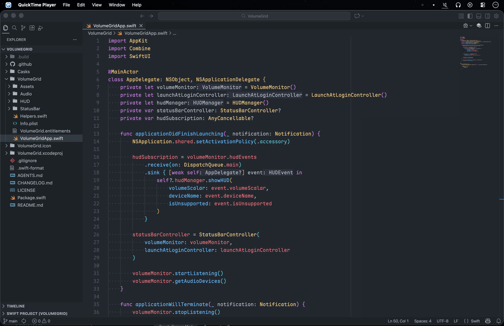

# VolumeGrid

  
Bringing back the classic volume HUD for macOS Tahoe 26 with more.

  
Install by cask: <code>brew tap euxx/casks ; brew install --cask volume-grid</code>,

  
or download from <a href="https://github.com/euxx/volume-grid/releases">Releases</a>

## Features

- 🔲 Classic 16-tile volume HUD with quarter-tile precision
- 🎧 Shows the sound output device and numeric volume on volume HUD
- 🖥️ Shows volume HUD on all displays
- 🔄 Shows volume HUD when switching sound output devices
- 🔊 Menu bar icon with subtle progress bar that changes with volume
- 🛠️ Native, minimal, lightweight (~2MB app, ~20MB RAM)

## Background

macOS Tahoe 26 replaced the classic 16-tile volume HUD with a smaller one that appears only in the top-right corner of the active display.

The new HUD is hard to read at a glance, especially on multiple displays where the active screen might not be the one in use.

Due to varying volume levels across different apps and websites, I frequently adjust the volume. So I built VolumeGrid and have been using it since day one. It should be stable after several iterations and edge case fixes.

## License

Under the [MIT](LICENSE) License.
