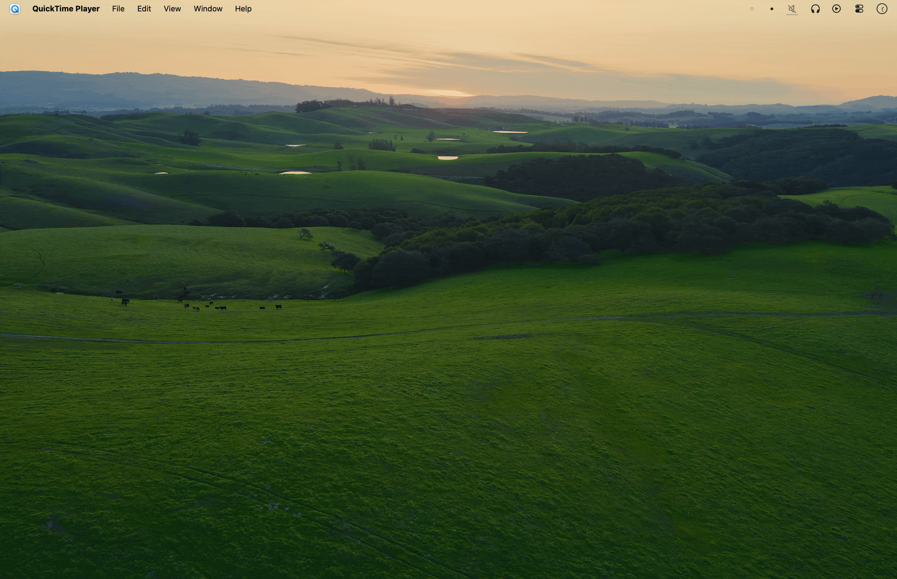
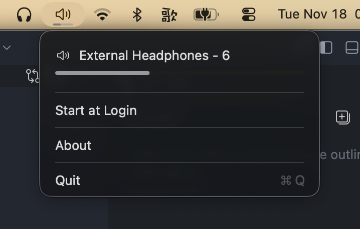

# VolumeGrid 

Bringing back the classic volume HUD for macOS Tahoe 26 with more.

## Features

- 🎵 Classic 16-tile volume HUD with quarter-tile precision
- 🎧 Shows the sound output device and numeric volume on volume HUD
- 🖥️ Shows volume HUD on all displays
- 🔄 Shows volume HUD when switching sound output devices
- 🔊 Menu bar icon with subtle progress bar that changes with volume
- 🛠️ Native, minimal, lightweight implementation





## Installation

Recommended for macOS Tahoe 26 and later.

### Via Homebrew Cask

Recommended for automatic updates.

```bash
brew install --cask euxx/VolumeGrid/volumegrid
```

### Manual Download

Download the latest release from [Releases](https://github.com/euxx/VolumeGrid/releases).

## Background

macOS Tahoe 26 replaced the classic 16-tile volume HUD with a smaller one that appears only in the top-right corner of the active display.

The new HUD is hard to read at a glance, especially on multiple displays where the active screen might not be the one in use.

Due to varying volume levels across different websites, videos, and music, I frequently adjust the volume. I have been using VolumeGrid since day one, going through several iterations and fixing edge cases.

## License

Under the [MIT](LICENSE) License.
