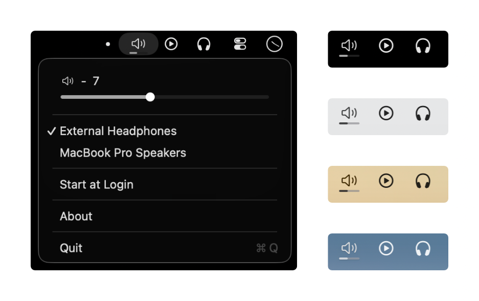
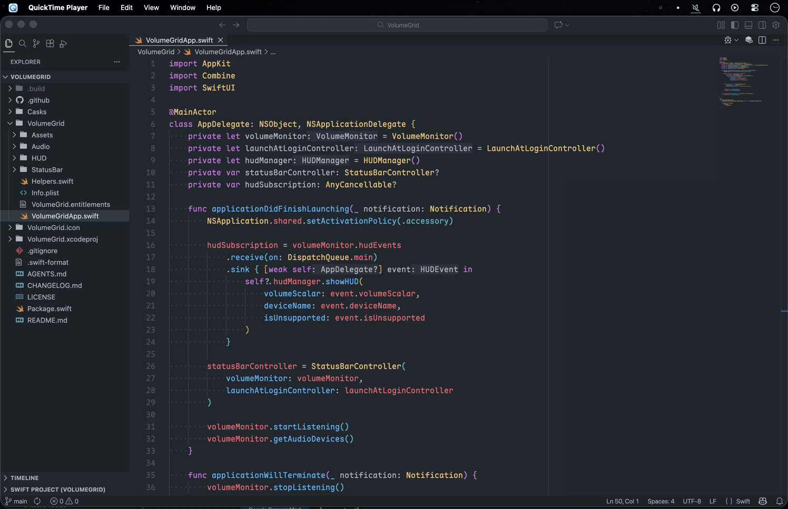

# VolumeGrid

  
Bringing back the classic volume HUD for macOS Tahoe 26 with more.

  
Install by cask: <code>brew install --cask euxx/casks/volume-grid</code>, or download from <a href="https://github.com/euxx/volume-grid/releases">Releases</a>.

  
You may need: <code>xattr -rd com.apple.quarantine /Applications/Volume\ Grid.app</code>.

## Features

- 🔲 Classic 16-tile volume HUD with quarter-tile precision
- 🎧 Shows the sound output device and numeric volume on volume HUD
- 🖥️ Shows volume HUD on all displays
- 🔄 Shows volume HUD when switching sound output devices
- 🔊 Menu bar icon with subtle progress bar that changes with volume
- 🎧 Switch sound output devices from the menu bar icon's menu
- 🎚️ Smart Volume — automatically adjusts system volume to maintain consistent loudness
- 🛠️ Native, minimal, lightweight (~2MB app, ~20MB RAM)

### Smart Volume

Smart Volume silently monitors the audio output bus and adjusts system volume in real time so the perceived loudness stays at a level you choose — no more cranking up the volume for a quiet video only to be blasted by the next one.

**Settings** (accessible from the menu bar icon):

| Setting | Description |
|---|---|
| Volume Grid Range | Min/max bar counts the AGC is allowed to set |
| Target Loudness | Desired RMS level (quiet → loud, default: normal) |
| Response Speed | How quickly the AGC reacts (fast ↔ smooth) |

## Plan

- [x] Switch sound output devices from the menu bar icon's menu

## Background

macOS Tahoe 26 replaced the classic 16-tile volume HUD with a smaller one that appears only in the top-right corner of the active display.

The new HUD is hard to read at a glance, especially on multiple displays where the active screen might not be the one in use.

Due to varying volume levels across different apps and websites, I frequently adjust the volume. So I built VolumeGrid and have been using it since day one. It should be stable after several iterations and edge case fixes.

## License

Under the [MIT](LICENSE) License.
